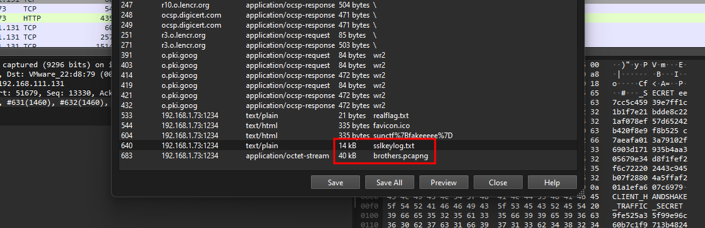
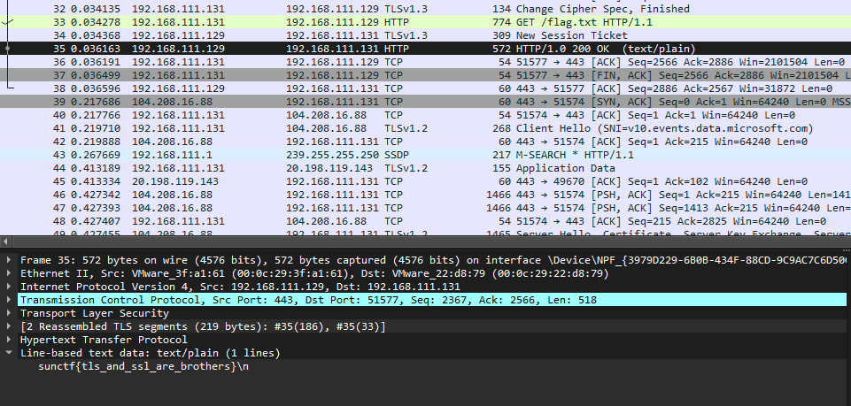

# Call of Protocols

| Key            | Value                                                                                                                                            |
|----------------|--------------------------------------------------------------------------------------------------------------------------------------------------|
| Challenge Name | Call of Protocols                                                                                                                                |
| Author         | warlocksmurf                                                                                                                                     |
| Category       | Forensics                                                                                                                                        |
| Description    | It must work, it must be secure, it should be as fast as reasonably possible, it must be modular/extensible, it must be easy to read/understand. |
| Challenge Type | Static                                                                                                                                           |
| Flag           | sunctf{tls_and_ssl_are_brothers}                                                                                                                 |
| Score          | ???                                                                                                                                              |

*File(s) in `attachments/` are distributed to the participants.*

## Solution

Click to expand

1) Extract HTTP objects for a sslkey log file and a PCAP file

   

2) Use the sslkey log file to decrypt the TLS packets in the other PCAP file

   

