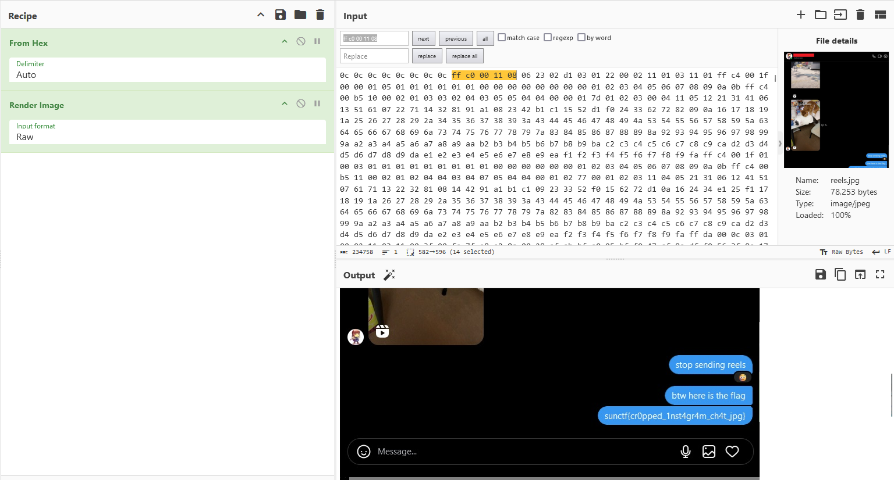

# Graded Reels

| Key            | Value                                                             |
|----------------|-------------------------------------------------------------------|
| Challenge Name | Graded Reels                                                      |
| Author         | warlocksmurf                                                      |
| Category       | Forensics                                                         |
| Description    | After grading my friend's Instagram reels, I gave him the flag as a reward.      |
| Challenge Type | Static                                                            |
| Flag           | sunctf{cr0pped_1nst4gr4m_ch4t_jpg}                                |
| Score          | ???                                                               |

*File(s) in `attachments/` are distributed to the participants.*

## Solution

Click to expand

1) Adjust the height of the JPG image to reveal the flag. https://cyberhacktics.com/hiding-information-by-changing-an-images-height/

   

