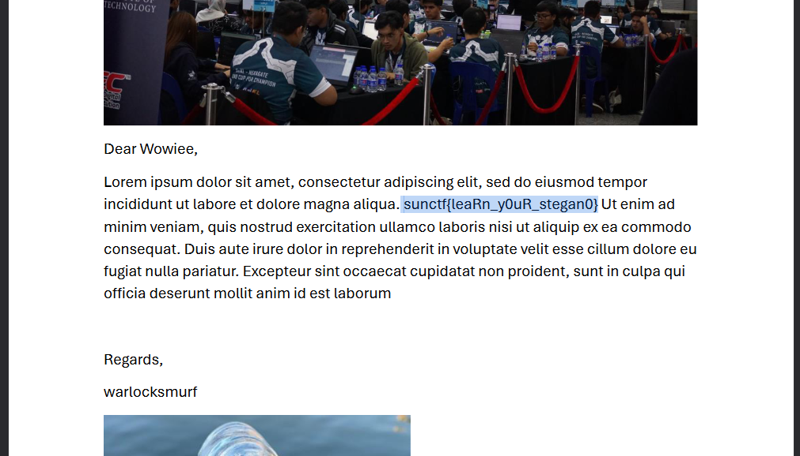

# Graduation Letter

| Key            | Value                                                                           |
|----------------|---------------------------------------------------------------------------------|
| Challenge Name | Graduation Letter                                                               |
| Author         | warlocksmurf                                                                    |
| Category       | Forensics                                                                       |
| Description    | Hope my friend can see this letter so that he knows I am graduating next month. |
| Challenge Type | Static                                                                          |
| Flag           | sunctf{leaRn_y0uR_stegan0}                                                      |
| Score          | ???                                                                             |

*File(s) in `attachments/` are distributed to the participants.*

## Solution

<details>
<summary>Click to expand</summary>

1) binwalk the image to extract a password-protected ZIP file (the password is in the metadata of the image).

    ```
    └─$ binwalk -e convocation.jpg 
    
    DECIMAL       HEXADECIMAL     DESCRIPTION
    --------------------------------------------------------------------------------
    0             0x0             JPEG image data, JFIF standard 1.01
    67263         0x106BF         Zip archive data, encrypted compressed size: 76, uncompressed size: 48, name: bonfire.txt
    67391         0x1073F         Zip archive data, encrypted compressed size: 160352, uncompressed size: 163891, name: letter.pdf
    228001        0x37AA1         End of Zip archive, footer length: 22
    ```
    
    ```
    └─$ exiftool convocation.jpg 
    ExifTool Version Number         : 12.76
    File Name                       : convocation.jpg
    Directory                       : .
    File Size                       : 228 kB
    File Modification Date/Time     : 2024:06:29 11:33:52-04:00
    File Access Date/Time           : 2024:09:08 06:13:47-04:00
    File Inode Change Date/Time     : 2024:06:29 11:33:52-04:00
    File Permissions                : -rwxrwxrwx
    File Type                       : JPEG
    File Type Extension             : jpg
    MIME Type                       : image/jpeg
    JFIF Version                    : 1.01
    Resolution Unit                 : None
    X Resolution                    : 1
    Y Resolution                    : 1
    Comment                         : The password is bluelobsterislove
    Image Width                     : 640
    Image Height                    : 480
    Encoding Process                : Baseline DCT, Huffman coding
    Bits Per Sample                 : 8
    Color Components                : 3
    Y Cb Cr Sub Sampling            : YCbCr4:2:0 (2 2)
    Image Size                      : 640x480
    Megapixels                      : 0.307
    ```

2) A password-protected PDF file and TXT file can be extracted after unzipping. The TXT file mentioned something about John, so we can just brute force crack the PDF file with pdf2john.

    ```
    └─$ john hash -w=/usr/share/wordlists/rockyou.txt
    Using default input encoding: UTF-8
    Loaded 1 password hash (PDF [MD5 SHA2 RC4/AES 32/64])
    Cost 1 (revision) is 4 for all loaded hashes
    Will run 4 OpenMP threads
    Press 'q' or Ctrl-C to abort, almost any other key for status
    spongebob        (letter.pdf)     
    1g 0:00:00:00 DONE (2024-09-24 12:19) 100.0g/s 12800p/s 12800c/s 12800C/s 123456..diamond
    Use the "--show --format=PDF" options to display all of the cracked passwords reliably
    Session completed.
    ```

    

</details>
