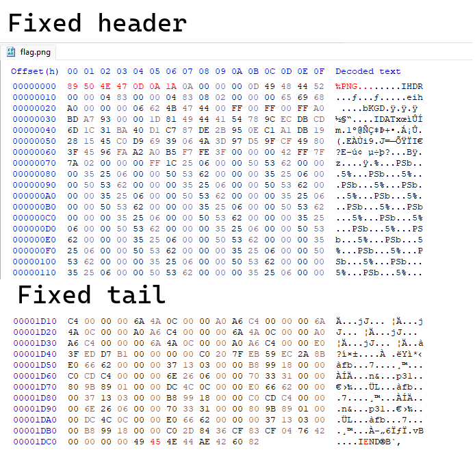
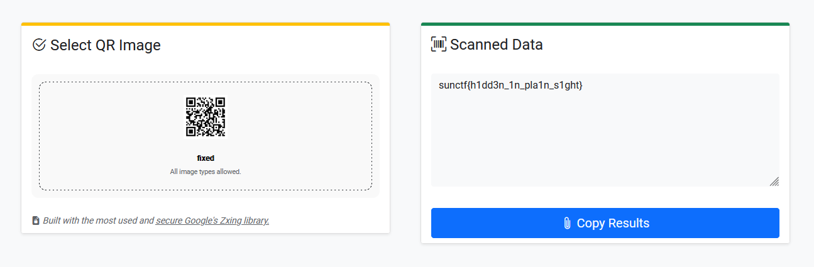

# Magic Show

| Key            | Value                                                                                                                        |
|----------------|------------------------------------------------------------------------------------------------------------------------------|
| Challenge Name | Magic Show                                                                                                                   |
| Author         | warlocksmurf                                                                                                                 |
| Category       | Forensics                                                                                                                    |
| Description    | Before my final exams, I enjoy scratching my head and tail I don't know why... Maybe my dandruff will turn into magic bytes? |
| Challenge Type | Static                                                                                                                       |
| Flag           | sunctf{h1dd3n_1n_pla1n_s1ght}                                                                                                |
| Score          | ???                                                                                                                          |

*File(s) in `attachments/` are distributed to the participants.*

## Solution

Click to expand

1) Fix the header and tail hex value of the PNG file.

   

2) Scan the QR code in the fixed PNG file

   

