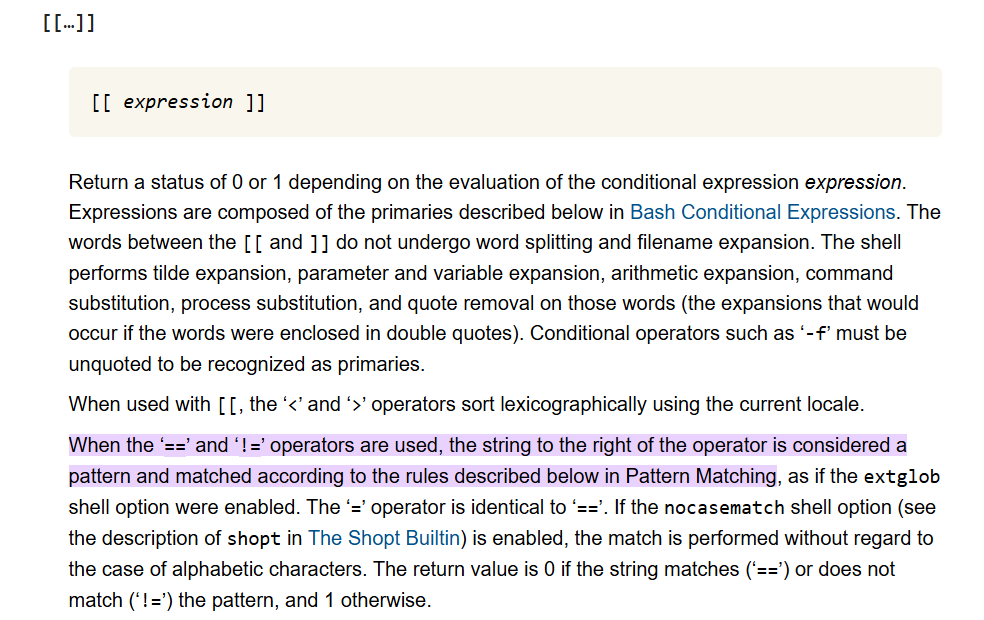

# guessTheFlag

| Key            | Value                                                                                                                               |
|----------------|-------------------------------------------------------------------------------------------------------------------------------------|
| Challenge Name | guessTheFlag                                                                                                                        |
| Author         | SuperTsumu                                                                                                                          |
| Category       | Misc                                                                                                                                |
| Description    | Find a way to bruteforce faster than your peers.                                                                                    |
| Challenge Type | Dynamic Docker                                                                                                                      |
| Docker Image   | [jaredliw/sunctf_misc_guesstheflag](https://hub.docker.com/repository/docker/jaredliw/sunctf_misc_guesstheflag/general) (port 8888) |
| Flag           | sunctf{c4n7_7h1nk_0f_fl46_n4m35}                                                                                                    |
| Score          | 400                                                                                                                                 |

*File(s) in `attachments/` are distributed to the participants.*

## Solution

Click to expand

Notice the use of `[[ ... ]]`, the server actually evaluates RegEx-like expression for pattern matching. Check out [Bash Reference Manual](https://www.gnu.org/savannah-checkouts/gnu/bash/manual/bash.html#:~:text=When%20the%20%E2%80%98%3D%3D%E2%80%99%20and%20%E2%80%98!%3D%E2%80%99%20operators%20are%20used%2C%20the%20string%20to%20the%20right%20of%20the%20operator%20is%20considered%20a%20pattern%20and%20matched%20according%20to%20the%20rules%20described%20below%20in%20Pattern%20Matching):

Warn: If you are trying to build and run the container from scratch, make sure that you are using LF in
`src/guessTheFlag.sh` to prevent error.

Note: `docs/solve.py` can be used to check if the challenge is working as intended. It will solve the challenge and get
the flag.
