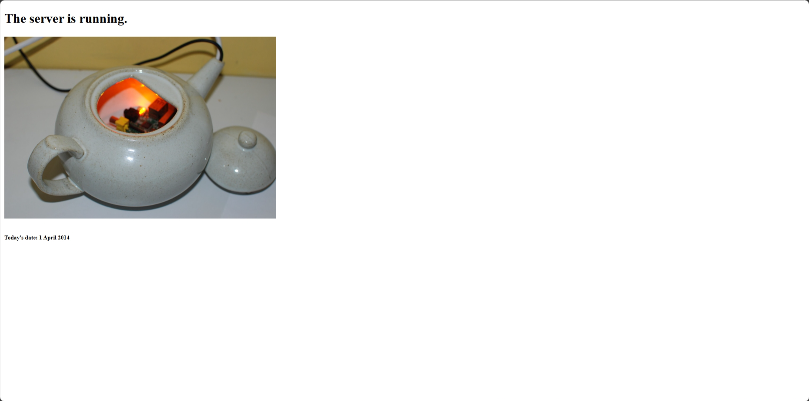
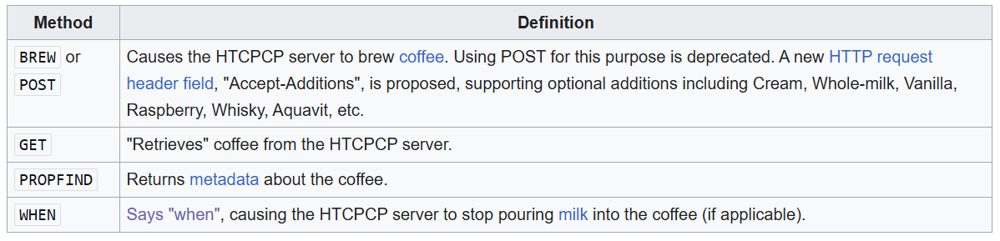

# Sit Back and Relax

| Key            | Value                                                                                                                                                        |
|----------------|--------------------------------------------------------------------------------------------------------------------------------------------------------------|
| Challenge Name | Sit Back and Relax                                                                                                                                           |
| Author         | wolfishLamb                                                                                                                                                  |
| Category       | Misc                                                                                                                                                         |
| Description    | Feeling tired after all those challenges? Take a break and have some coffee! Request the server to brew some coffee, probably it will dispense you the flag. |
| Challenge Type | Dynamic Docker                                                                                                                                               |
| Docker Image   | sunctf_misc_sit-back-and-relax (port 1338)                                                                                                                   |
| Flag           | sunctf{n3v3r_8r3W_c0ff33_1n_4_734p07}                                                                                                                        |
| Score          | 100                                                                                                                                                          |

*Hint 0: All the pages are the same, there is no hidden page.* \
*Hint 1: Look closely on EVERYTHING you can see. Know what to do to get the flag?* \
*Hint 2: Send a POST request and see.* \
*Hint 3: Where is the source of the teapot image?* \
*Final hint: Do you know HTCPCP?*




## Solution

<details>
<summary>Click to expand</summary>

This is meant to be an OSINT, in a hidden way.

This challenge is a reference to the HTTP method `BREW`. The `BREW` method is not a standard HTTP method, but it is
defined in RFC 2324 as an April Fools' joke.

Hidden hints:

1) The challenge description hints that the server will dispense the flag if you "request" it to "brew" some coffee.
2) The date shown is the date HTCPCP proposed.
3) If you request any pages using a POST method, you will get a deprecated message and the message "RFC 2324".
4) The teapot image is the back-end infrastructure of [error418.net](http://error418.net/), which implements HTCPCP 
   using a teapot and Raspberry Pi. 
5) On the Wikipedia page for HTCPCP, you can find the `BREW` method, which asks the server to brew coffee.
   

To solve the challenge, you can send a `BREW` request to the server using `curl` or any similar tools. The flag will be
returned in the response.

```commandline
curl --request BREW <the_server_url>
```

</details>

Note: `docs/solve.py` can be used to check if the challenge is working as intended. It will solve the challenge and get
the flag.