# HR Department 1

| Key            | Value                                                                                                                                       |
|----------------|---------------------------------------------------------------------------------------------------------------------------------------------|
| Challenge Name | HR Department 1                                                                                                                             |
| Author         | warlocksmurf                                                                                                                                |
| Category       | OSINT                                                                                                                                       |
| Description    | Hello, you've reached SunwayCSC! Please contact Xiao for further inquiries with our team. You can reach out to him at xiaoooi123@gmail.com. |
| Challenge Type | Static                                                                                                                                      |
| Flag           | sunctf{the_c00l_yaksha}                                                                                                                     |
| Score          | ???                                                                                                                                         |

## Solution

Click to expand

1) Send email for auto reply.

   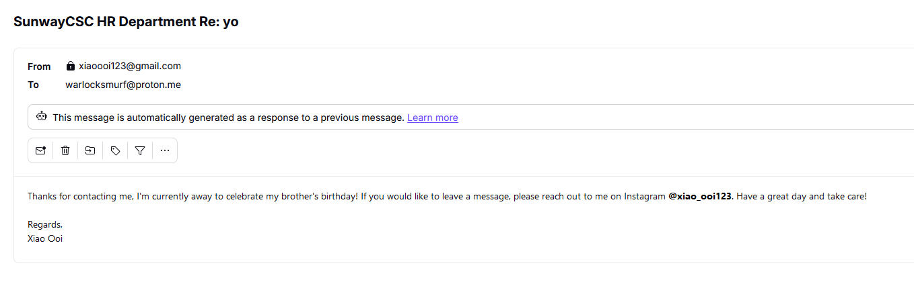

2) Find [account on Instagram](https://www.instagram.com/xiao_ooi123/), the flag is
   in [one of the post](https://www.instagram.com/p/C8R6F_5vtB_/?utm_source=ig_web_copy_link&igsh=MzRlODBiNWFlZA==).

   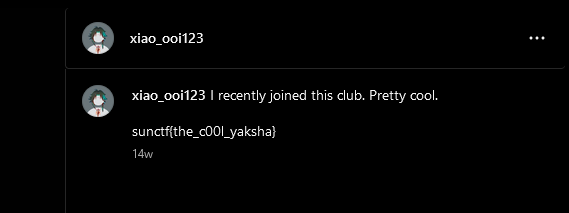

# HR Department 2

| Key            | Value                                                                                                                                                                                                                                      |
|----------------|--------------------------------------------------------------------------------------------------------------------------------------------------------------------------------------------------------------------------------------------|
| Challenge Name | HR Department 2                                                                                                                                                                                                                            |
| Author         | warlocksmurf                                                                                                                                                                                                                               |
| Category       | OSINT                                                                                                                                                                                                                                      |
| Description    | A cybersecurity meetup was held at Sunway University sometime this year, but our friend Garry could not make it. I wonder what Garry is up to lately other than being a Discord moderator in a server. Flag format: sunctf{all_lower_case} |
| Challenge Type | Static                                                                                                                                                                                                                                     |
| Flag           | sunctf{wizard_of_legends}                                                                                                                                                                                                                  |
| Score          | ???                                                                                                                                                                                                                                        |

## Solution

Click to expand

1) Check [another post](https://www.instagram.com/p/C8SBxUjvnP0/?utm_source=ig_web_copy_link&igsh=MzRlODBiNWFlZA==) with
   Robbin's comment.

   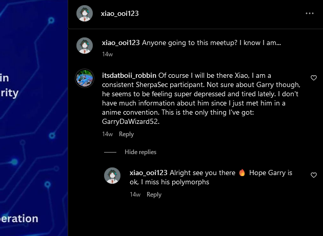

2) Find [Garry's account on Twitter](https://x.com/GarryDaWizard52) with the [Discord link](https://t.co/1P1GWidEn1).

   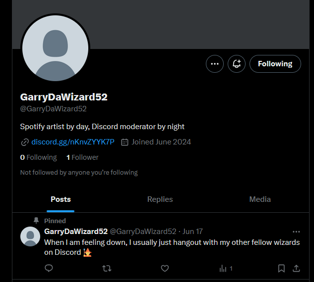

3) Garry mentioned something about Spotify, flag is the first word for each song in
   the [album](https://open.spotify.com/playlist/6khqM2s7SDNVfpKMRHYzLu) (*his Spotify account is also linked to his
   Discord).

   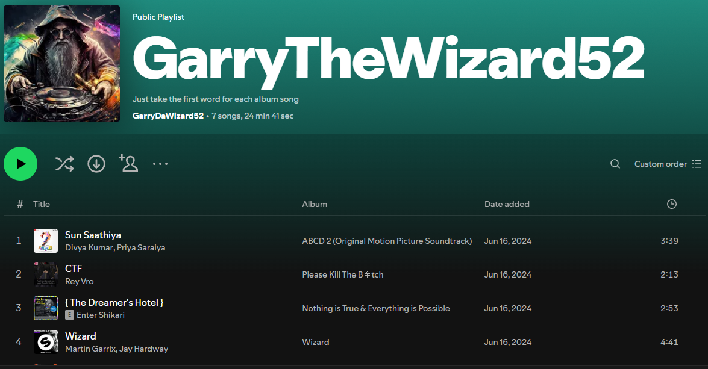

# HR Department 3

| Key            | Value                                                                                                      |
|----------------|------------------------------------------------------------------------------------------------------------|
| Challenge Name | HR Department 3                                                                                            |
| Author         | warlocksmurf                                                                                               |
| Category       | OSINT                                                                                                      |
| Description    | What is the name of the new hangout location mentioned by Gorlock? Flag format: sunctf{sunway_university}. |
| Challenge Type | Static                                                                                                     |
| Flag           | sunctf{piccoli_lotti}                                                                                      |
| Score          | ???                                                                                                        |

## Solution

Click to expand

1) After joining the Discord server, identify the location mentioned by Gorlock. The chat mentioned something about SS18
   and roadside. You can find this place
   on [Google Maps](https://www.google.com/maps/@3.0728049,101.5855206,3a,54.5y,247.35h,88.22t/data=!3m6!1e1!3m4!1sIFYo-jCndeKgdO3qh6oWug!2e0!7i16384!8i8192?coh=205409&entry=ttu&g_ep=EgoyMDI0MDkyNS4wIKXMDSoASAFQAw%3D%3D).

   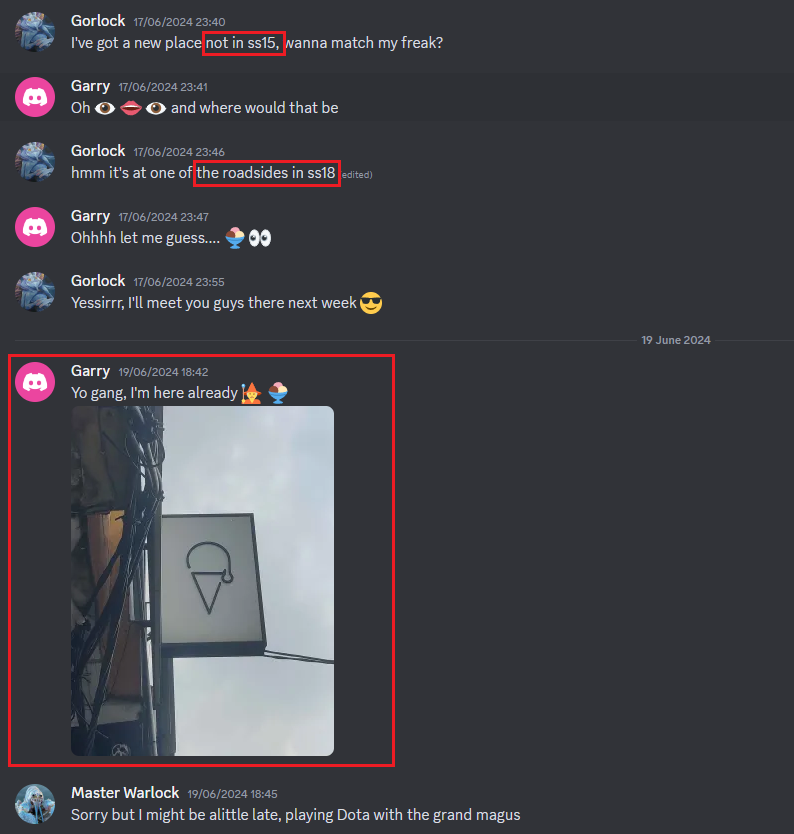

# HR Department 4

| Key            | Value                                                                                                    |
|----------------|----------------------------------------------------------------------------------------------------------|
| Challenge Name | HR Department 4                                                                                          |
| Author         | warlocksmurf                                                                                             |
| Category       | OSINT                                                                                                    |
| Description    | Someone recently got certified from Skibidi Toilet Academy, I assume he will be posting it on job sites? |
| Challenge Type | Static                                                                                                   |
| Flag           | sunctf{b0nus_0s1nt_4_y0u!}                                                                               |
| Score          | ???                                                                                                      |

## Solution

Click to expand

1) Find [Master Warlock on LinkedIn](https://my.linkedin.com/in/master-warlock-59b578322), one of the certs has
   a [URL to YouTube](https://www.youtube.com/channel/UCSEFqumX7b__n0yBJeNjrWA).

   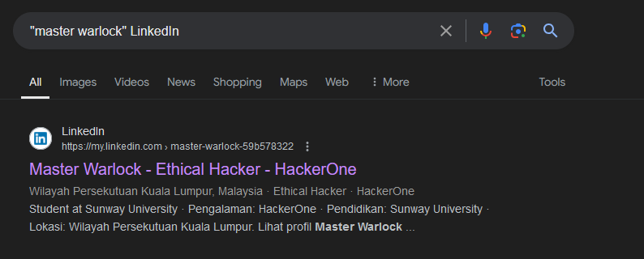

   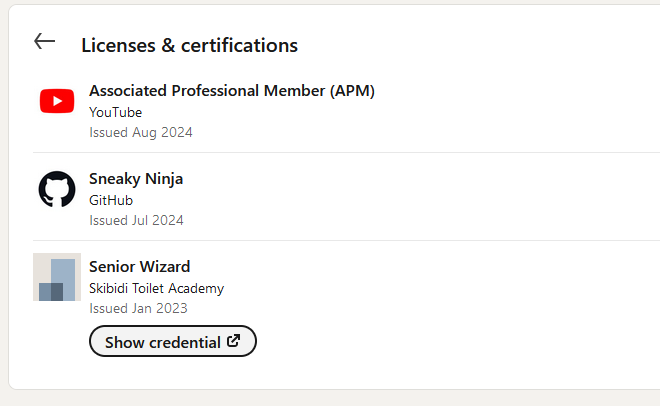

2) A comment in the YouTube video gives [a GitHub link](https://github.com/warlocksmurf), encoded in base64.

   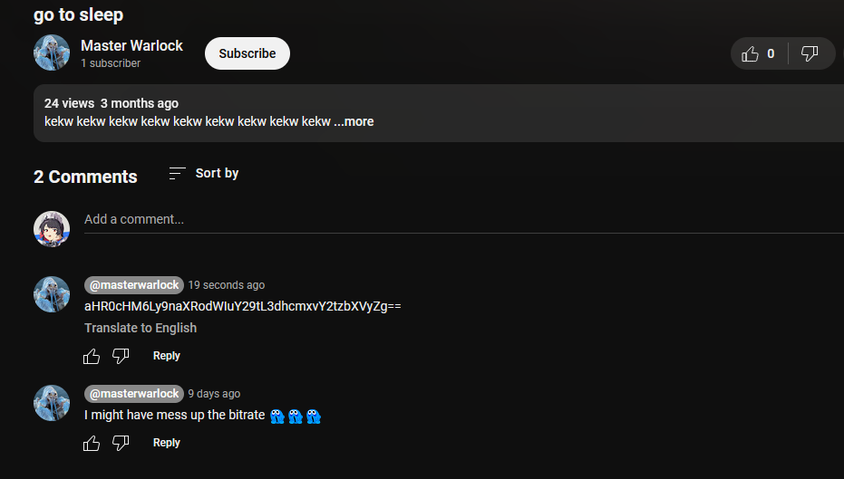

3) In the GitHub, a repository
   has [a commit](https://github.com/warlocksmurf/top-secret/commit/8ef5cc2cc0cb956124ea5cb5f03f0103aa3fe4eb) that shows
   a CTFtime team name.

   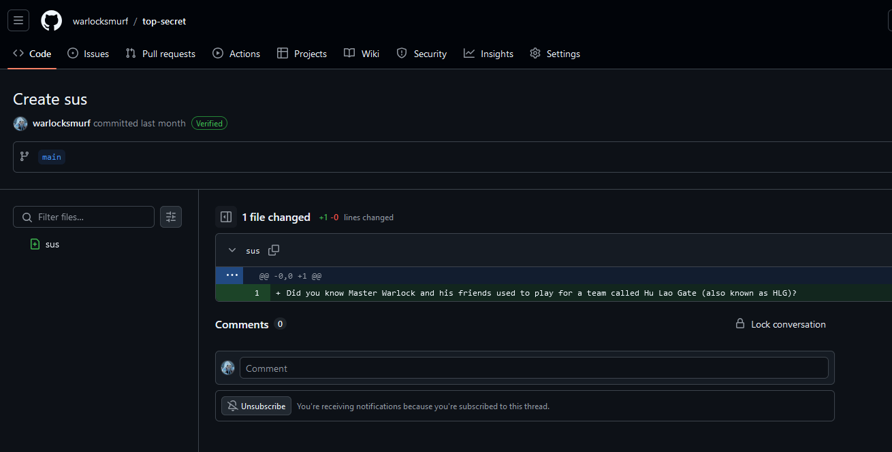

4) The [CTFtime team](https://ctftime.org/team/276386) description
   has [a link to Pastebin](https://pastebin.com/DXYBMhi7), pastebin password is in [imgur](https://imgur.com/a/aGzjIfs)
   sent in the Discord chat. Password is `Cm6madAJ1e`.

   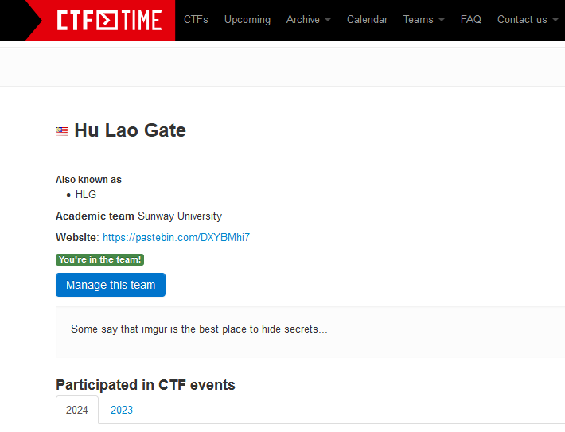

   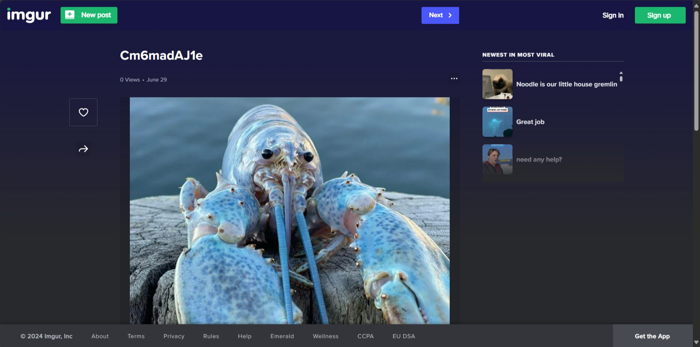

5) Unlock the paste and the flag is there.
   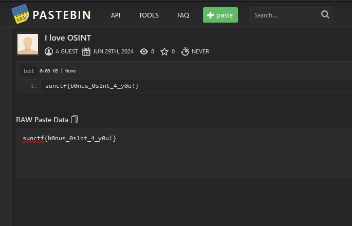

