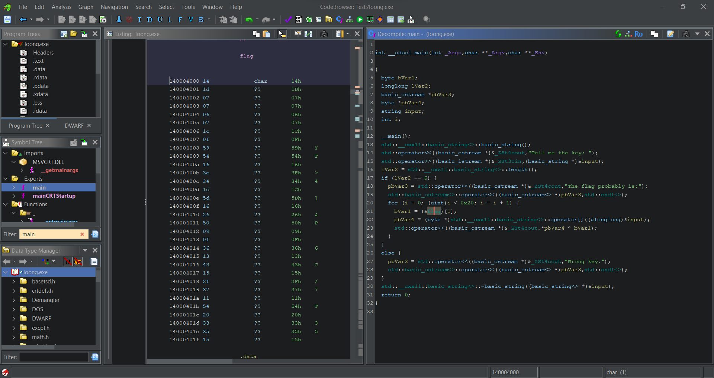

# Loong

| Key            | Value                                          |
|----------------|------------------------------------------------|
| Challenge Name | Loong                                          |
| Author         | wolfishLamb                                    |
| Category       | Rev                                            |
| Description    | Nothing to tell, take a close look at the EXE. |
| Challenge Type | Static                                         |
| Flag           | sunctf{g00d_St4rT1ng_w1tH_x0RRR}               |
| Score          | ???                                            |

*File(s) in `attachments/` are distributed to the participants.*

## Solution

<details>
<summary>Click to expand</summary>

First thing first, decompile the source code and analyse. The decompiled code above is attached here:
`docs/decompiled.cpp`.

1) First piece of info, the length of the key is 6:
   ```cpp
   std::operator<<((basic_ostream *)&_ZSt4cout,"Tell me the key: ");
   std::operator>>((basic_istream *)&_ZSt3cin,(basic_string *)&input);
   lVar2 = std::__cxx11::basic_string<>::length();
   if (lVar2 == 6) {
      ...
   ```
   You can tell this is a C++ program from `cout` and `cin` above.

2) The `flag` is XORed with our input, letter by letter. And also, the `flag` length is `0x20 = 32`.
   ```cpp
   for (i = 0; (uint)i < 0x20; i = i + 1) {
     bVar1 = flag[i];
     pbVar4 = (byte *)std::__cxx11::basic_string<>::operator[]((ulonglong)&input);
     std::operator<<((basic_ostream *)&_ZSt4cout,*pbVar4 ^ bVar1);
   }
   ```
   `pbVar4` that line looks a bit odd, maybe other tool works better than Ghidra (the one I am using). But no matter
   how, the code actually corresponds to `flag[i] ^ input[i % 6]`. The key repeats every 6 characters.

3) What's `flag`? Look into the listing:
   
   `14h`, `1Dh`, `07h`, `07h`, ... are the hex characters in `flag` array, exactly 32 of them.

4) We know `14h, 1Dh, 07h, 07h, 06h, 07h` should correspond to `s, u, n, c, t, f` (i.e. `73h, 75h, 6Eh, 63h, 74h, 66h`).
   Also, plain text XOR key = cipher, conversely key XOR cipher = plain text. Working backwards,
   ```
            14h, 1Dh, 07h, 07h, 06h, 07h
   XOR      73h, 75h, 6Eh, 63h, 74h, 66h
   -------------------------------------
            67h, 68h, 69h, 64h, 72h, 61h
              g,   h,   i,   d,   r,   a
   ``` 
   We get the key -- `ghidra`.

5) Enter the key and get the flag.
</details>

Note: `docs/solve.py` can be used to check if the challenge is working as intended. It will solve the challenge and get
the flag.
