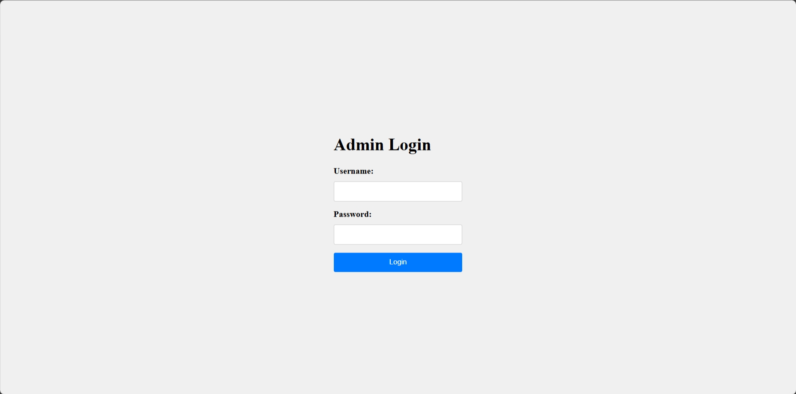

# Nasi Kandar

| Key            | Value                                                  |
|----------------|--------------------------------------------------------|
| Challenge Name | Nasi Kandar                                            |
| Author         | chuajianshen                                           |
| Category       | Web                                                    |
| Description    | Guess the price of your *nasi kandar* to win a flag.   |
| Challenge Type | Dynamic Docker                                         |
| Docker Image   | sunctf_web_nasi-kandar (port 5002)                     |
| Flag           | sunctf{mySQL_is_insensItive_strict_is_the_B3st}        |
| Score          | ???                                                    |

*File(s) in `attachments/` are distributed to the participants.*

## Solution

Click to expand

1) Login with `Admin` or any mix of uppercase and lowercase letters due to the case-insensitive nature of MySQL.
2) Generate a valid cookie (see `docs/cookie.php`) with boolean `true` in price property to bypass the price check.
   `integer == true` is always true, as the type is not enforced (see 
   [PHP manual](https://www.php.net/manual/en/types.comparisons.php)). For strict comparison, `===` should be used.
3) Send a GET request to `/price.php` to obtain the flag.

> Related: Type Juggling, Insecure Direct Object Reference (IDOR)

Note: `docs/solve.py` can be used to check if the challenge is working as intended. It will solve the challenge and get
the flag.
