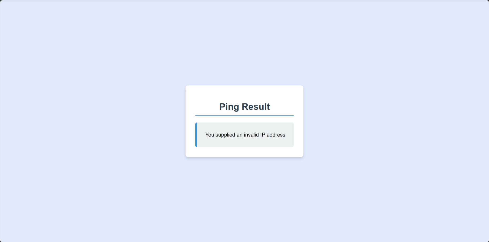

# Ping

| Key            | Value                                                            |
|----------------|------------------------------------------------------------------|
| Challenge Name | Ping                                                             |
| Author         | chuajianshen                                                     |
| Category       | Web                                                              |
| Description    | My security friend said my uni ping project has a serious bug??? |
| Challenge Type | Dynamic Docker                                                   |
| Docker Image   | sunctf_web_ping (port 5004)                                      |
| Flag           | sunctf{uNLimited_moNey_iS_so_C00l}                               |
| Score          | ???                                                              |

*File(s) in `attachments/` are distributed to the participants.*

## Solution

Click to expand

1) Notice the command injection in `user_supplied_IP` due to IPv6 zone
   parsing [https://docs.python.org/3/library/ipaddress.html](https://docs.python.org/3/library/ipaddress.html#:~:text=zone).
2) Supply a valid IPv6 address such as `::1%;cat flag.txt;`
3) Obtain flag.

> Related: *Remote Code Execution (RCE)*, Command Injection

Note: `docs/solve.py` can be used to check if the challenge is working as intended. It will solve the challenge and get
the flag.
