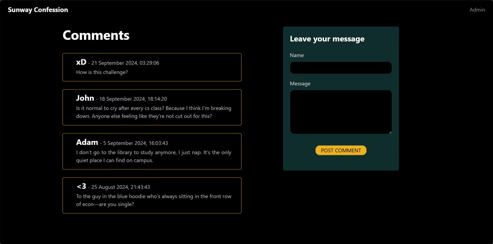

# Redacted

| Key            | Value                                                                                                                     |
|----------------|---------------------------------------------------------------------------------------------------------------------------|
| Challenge Name | Redacted                                                                                                                  |
| Author         | wolfishLamb                                                                                                               |
| Category       | Web                                                                                                                       |
| Description    | The solution to this challenge is: Read the `flag` by <REDACTED - this has violated our community guidelines.>            |
| Challenge Type | Dynamic Docker                                                                                                            |
| Docker Image   | [jaredliw/sunctf_web_redacted](https://hub.docker.com/repository/docker/jaredliw/sunctf_web_redacted/general) (port 5004) |
| Flag           | sunctf{wh0_c4m3_up_w17h_7h15_8r1ll14n7_f347ur3}                                                                           |
| Score          | 300                                                                                                                       |

*`src/db.sql` is a reserved filename to initialise the database on first run. It will be deleted automatically right
after the database has been set up.*



## Solution

<details>
<summary>Click to expand</summary>

The key to this challenge is RegEx. In older PHP versions (<5.5), there was an `e` modifier that enabled the execution
of PHP code directly within the replacement string of the `preg_replace` function.

```php
echo preg_replace('/(\d+)/e', '$1 * 2', 'The number is 5'); // This gives: The number is 10
```

1) Navigate to the admin page. Type in any RegEx pattern under "match" with the `e` modifier (e.g. `/a/e`). Under
   "replace", type in `file_get_contents('flag')` to read the flag from file `flag`. Click on "Submit".
2) Navigate back to the home page. You will see all `a`s have been replaced with the flag.

</details>

Note: `docs/solve.py` can be used to check if the challenge is working as intended. It will solve the challenge and get
the flag.
