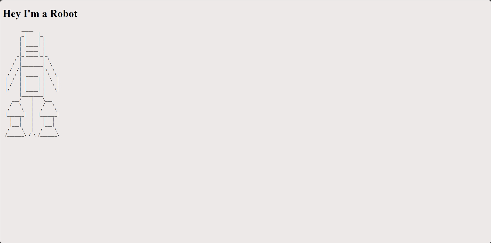

# Robots

| Key            | Value                                  |
|----------------|----------------------------------------|
| Challenge Name | Robots                                 |
| Author         | chuajianshen                           |
| Category       | Web                                    |
| Description    | Yet another robots web challenge.      |
| Challenge Type | Static Docker                          |
| Docker Image   | jaredliw/sunctf_web_robots (port 5000) |
| Flag           | sunctf{rAndom_is_n0t_truly_rand0m}     |
| Score          | 100                                    |



## Solution

<details>
<summary>Click to expand</summary>

1) Go to `/robots.txt` to discover `/codeGen.php` and `/flag.php`.
2) In `/codeGen.php`, there is a random number function with a fixed seed, causing it to produce the same number
   everytime. Copy and execute the code displayed to obtain the number.

    ```php
    $seed = 16062024;

    mt_srand($seed);
    
    for ($i = 0; $i <= 100; $i++){
        $secretcode = mt_rand();
    }

    echo $secretcode;
    ```

3) Input the number at `flag.php` to get the flag.

</details>

Note: `docs/solve.py` can be used to check if the challenge is working as intended. It will solve the challenge and get
the flag. Change the URL to the remote instance to mimic a participant.