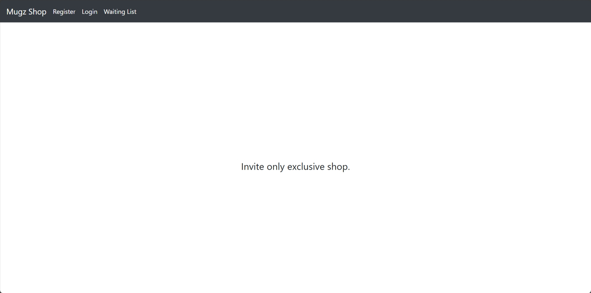

# Shopping Spree Real Fun

| Key            | Value                                                            |
|----------------|------------------------------------------------------------------|
| Challenge Name | Shopping Spree Real Fun                                          |
| Author         | chuajianshen                                                     |
| Category       | Web                                                              |
| Description    | Admins tried to disable my money glitch but I still found a way. |
| Challenge Type | Dynamic Docker                                                   |
| Docker Image   | sunctf_web_shopping-spree-real-fun (port 5003)                   |
| Flag           | sunctf{uNLimited_moNey_iS_so_C00l}                               |
| Score          | ???                                                              |

## Solution

Click to expand

1) Trick the server to hit the registration endpoint, as only admins are allowed to register an account. Use tool like
   Burp Suite to intercept the requests. Notice the `path` parameter in the `/invite` request? We can change the
   `/admin` to `/register?username=shen%26password=shen`. The `%26` is the URL-encoded form of `&`.
2) Each user has only \$50, which is not enough to buy the flag with a price of \$100. To get more \$\$\$, buy a
   negative quantity of mugs. For example, buying -5 mugs will deduct `$10 * (-5) = -$50`. Deducting a negative amount
   will add to your account balance.
3) Buy the flag and look for the flag in `/account`.

> Related: *Server Side Request Forgery (SSRF)*, *Business Logic Flaw*

Note: `docs/solve.py` can be used to check if the challenge is working as intended. It will solve the challenge and get
the flag.